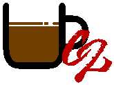
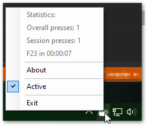
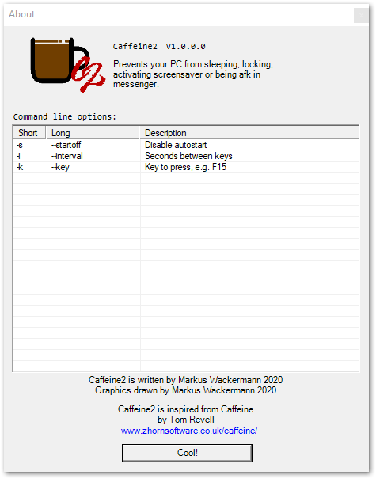

Caffeine2
=========

Prevents your PC from sleeping, locking, activating screensaver or being afk in messenger.

### Features
- Runs in background
- Presses F23 (or any other Key defined by CLI parameter)

### Enjoying this?
Just star the repo or make a donation.

Your help is valuable since this is a hobby project for all of us: we do development during out-of-office hours.

### Contribution
Pull requests are very welcome.

### Copyright
This version was written by **Markus Karl Wackermann**
